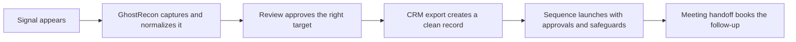

# slide 0 #
## The problem ##
### bullet points ###
- Sales teams waste time chasing scattered signals across sources, spreadsheets, and manual follow-up.
- Good opportunities get missed because intelligence is slow to enrich, review, and route.
- Bad or incomplete data creates CRM clutter, compliance risk, and wasted outreach.

# slide 1 #
## Why GhostRecon matters for sales ##
### bullet points ###
- Turns external cyber intelligence into usable sales opportunities.
- Automates discovery, enrichment, review, export, sequencing, and meeting handoff.
- Reduces manual research so the team spends more time selling and less time stitching data together.

# slide 1.5 #
## Sales workflow ##
### bullet points ###

# slide 2 #
## Events ##
### bullet points ###
- Automatically surfaces relevant events and normalizes venue, geography, and timing.
- Queues eligible participants for enrichment instead of making reps hunt for contacts.
- Keeps only approved, reusable records moving forward.

# slide 3 #
## Incidents ##
### bullet points ###
- Converts incident news into company-specific opportunities and watch targets.
- Supports corroboration and rejection so the team focuses on real, high-signal accounts.
- Promotes the right accounts without duplicating or misclassifying cases.

# slide 4 #
## Watchlists ##
### bullet points ###
- Monitors priority companies and domains continuously.
- Triggers follow-on coverage and contact discovery automatically.
- Gives sales a live view of who to watch, who owns it, and what changed.

# slide 5 #
## Review ##
### bullet points ###
- Gives analysts a bounded queue for fast, policy-aware decisions.
- Automates approval, rejection, and bulk handling with audit trails.
- Prevents bad data from reaching the CRM or outbound motion.

# slide 6 #
## CRM Exports ##
### bullet points ###
- Turns approved targets into clean CRM export batches.
- Retries failed items without rework or duplicate effort.
- Separates export approval from outreach, keeping the process controlled.

# slide 7 #
## Sequences ##
### bullet points ###
- Enrolls only exported, approved targets with separate outreach approval.
- Automates sends, replies, bounces, unsubscribes, and rate-limit checks.
- Protects the team from compliance mistakes while keeping outreach moving.

# slide 8 #
## Meetings ##
### bullet points ###
- Books handoff meetings from approved targets with the right checks in place.
- Generates prep packets and syncs outcomes back to CRM.
- Closes the loop so opportunities move from intelligence to action with less friction.
