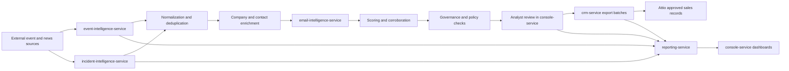

# GhostRecon

GhostRecon is an intelligence-first cyber-event and incident monitoring platform for cybersecurity revenue teams. It discovers global events, permitted published participants, and affected companies from external sources; normalizes and corroborates that intelligence; enriches eligible business contacts; and requires analyst approval before exporting sales records to a CRM.

Attio is the first CRM implementation and remains authoritative for approved sales records. CRM ingestion is a compatibility path, not the primary acquisition path. `deep-research-report.md` remains historical research; [ADR 0004](docs/adr/0004-intelligence-first-acquisition.md) records the implementation direction.

## Primary Flow



The pipeline is external sources → normalization and deduplication → contact enrichment → scoring and governance → analyst review → CRM export → reporting. Event or incident intelligence never enrolls a contact into outreach automatically. The shared Sprint 3 source registry foundation now persists source definitions, raw source items, source policy metadata, freshness/checkpoint state, hashes, permitted excerpts, and source-ingestion events for later event and incident services.

## Microservices

| Service | Purpose |
| --- | --- |
| `gateway-service` | Authenticated API entrypoint and route map for intelligence, review, reporting, and export APIs. |
| `event-intelligence-service` | Global cybersecurity event, series, and permitted published-participant discovery on top of the implemented shared source registry. |
| `incident-intelligence-service` | Global cyber-incident news discovery, affected-company identification, corroboration evidence, and watchlists on top of the shared source registry. |
| `ingestion-service` | Attio webhook/import compatibility and idempotent inbound event intake; not the primary acquisition path. |
| `enrichment-service` | Entity resolution and public company/contact enrichment from approved sources. |
| `email-intelligence-service` | Eligible business-email candidate generation and verification. |
| `scoring-routing-service` | Fit, relevance, evidence, confidence, and routing rules. |
| `governance-service` | Source permissions, suppression, retention, approval, audit, and replay controls. |
| `console-service` | Existing FastAPI/Jinja intelligence dashboard and analyst review interface. |
| `reporting-service` | Intelligence, source-health, review, export, and revenue-workflow read models. |
| `crm-service` | Review-gated Attio export and provider-neutral `CrmClient` boundary. |
| `sequencing-service` | In-house sequence eligibility and future SMTP/IMAP execution after separate approval. |
| `meeting-handoff-service` | AE/SE prep packets and meeting-handoff workflows. |

The shared `SourceDefinition` / `RawSourceItem` runtime foundation is implemented in the common package and exposed through gateway/reporting source-health APIs. Event and incident intelligence runtimes are implemented and included in Helm; incident discovery stores article metadata, permitted excerpts, candidate incidents, evidence lineage, and watch targets.

## Implemented Source Registry Foundation

Sprint 3 adds the shared intelligence ingestion foundation used by future event and incident services:

- PostgreSQL persistence for `SourceDefinition` and immutable `RawSourceItem` records.
- Shared adapters for HTTP pages, Schema.org JSON-LD events, ICS calendars, RSS/Atom feeds, and scheduled provider queries.
- Canonical URL normalization, content hashing, idempotency-key generation, duplicate quarantine, and permitted-excerpt enforcement.
- Source freshness and policy visibility through `GET /v1/intelligence/sources/health`.
- Source-ingestion events in the transactional outbox and the `ghostrecon.fetch_source` Celery task.

## Implemented Incident Intelligence Runtime

Sprint 5 adds the incident runtime used by later enrichment, governance, dashboard, and CRM-export work:

- PostgreSQL persistence for `NewsArticle`, `SecurityIncident`, `SecurityIncidentEvidence`, and `WatchTarget`.
- GDELT DOC discovery plus RSS/Atom advisory/news ingestion through the shared source registry.
- Canonical article dedupe, syndication grouping, affected-company candidates, attack-vector metadata, language/geography metadata, and source lineage.
- Candidate-first incident lifecycle with authoritative-source and independent-source corroboration support.
- Watch-target APIs for company, domain, incident, event-series, and topic monitoring, including idempotent promotion from a global incident.


## Source Policy

- Event adapters cover official conference pages, Schema.org `Event` data, ICS, RSS/Atom, and approved provider APIs. Initial series include DEF CON, Black Hat, BSides, OWASP, and FIRST.
- Incident discovery uses trusted RSS/Atom feeds, government and CERT advisories, configurable company/domain queries, and [GDELT DOC 2.0](https://blog.gdeltproject.org/gdelt-doc-2-0-api-debuts/) for multilingual global-news discovery.
- Store source metadata, hashes, URLs, and permitted excerpts. Do not persist unlicensed full articles.
- Published participant data is usable only when the source explicitly permits reuse. Unknown or prohibited reuse blocks contact extraction and CRM export.
- Incident contacts are limited to public business roles in security, IT, risk, and communications. Breached personal data is never collected.

## Production Defaults

- Python 3.12, FastAPI, Jinja, Pydantic, SQLAlchemy, Alembic, Celery, Redis, and PostgreSQL.
- Structured JSON logs, Prometheus metrics at `/metrics`, liveness at `/healthz`, and readiness at `/readyz`.
- Kubernetes deployment through Helm in `deploy/helm/ghostrecon`.
- SOPS + Age secret management for Helm values.
- Attio is implemented behind `CrmClient` so future CRMs can provide equivalent object, list, and reconciliation mappings.
- Paid enrichment APIs are not required. Public enrichment remains allowlisted, bounded, and source-attributed.

## Local Development

```bash
make install
make test
make dev
```

The local stack starts PostgreSQL, Redis, `gateway-service`, a Celery worker, and the email verifier sidecar.

Run one implemented service directly:

```bash
GHOSTRECON_SERVICE_NAME=enrichment-service \
uvicorn ghostrecon.service_apps.runtime:app --reload --port 8080
```

Run migrations:

```bash
make migrate
```

## Kubernetes Deployment

Validate bundled and external datastore modes with non-secret fixtures:

```bash
make helm-check
```

Render with decrypted SOPS values:

```bash
helm secrets template ghostrecon deploy/helm/ghostrecon \
  -f deploy/helm/ghostrecon/secrets.sops.yaml
```

Install or upgrade the implemented stack:

```bash
helm secrets upgrade --install ghostrecon deploy/helm/ghostrecon \
  --namespace ghostrecon \
  --create-namespace \
  --wait \
  --timeout 15m \
  -f deploy/helm/ghostrecon/secrets.sops.yaml \
  --set image.repository=registry.example.com/ghostrecon \
  --set image.tag=0.1.0
```

The default release provisions persistent PostgreSQL and Redis instances, creates the application database and role on an empty PostgreSQL volume, and runs Alembic migrations. Disable either bundled datastore and provide its encrypted external URL when using managed infrastructure.

Keep the Age private key outside the repository and encrypt `deploy/helm/ghostrecon/secrets.sops.yaml` before deployment. Chart-local guidance is in `deploy/helm/ghostrecon/README.md` and `deploy/helm/ghostrecon/SECRETS.md`.

## Compliance and Safety

GhostRecon stores source lineage, source-reuse policy, idempotency keys, evidence links, suppression state, review decisions, export audits, and retention metadata. Crawler behavior must remain allowlisted, bounded, robots-aware by default, and limited to publicly visible pages. Generated email candidates are not verified contacts. A CRM export approval is not an outreach approval; sequencing performs its own current suppression, lawful-basis, and approval checks.

## Documentation

- [Sprint tracker](SPRINTS.md)
- [Architecture](docs/architecture.md)
- [Intelligence pipeline and data model](docs/specifications/intelligence-pipeline.md)
- [Dashboard product specification](docs/specifications/dashboard.md)
- [Operations runbook](docs/runbooks/operations.md)
- [Intelligence-first acquisition ADR](docs/adr/0004-intelligence-first-acquisition.md)

Every service directory under `services/` contains an operator `README.md` and an engineering `TECHNICAL_README.md`.
