# GhostRecon

GhostRecon is an intelligence-first cyber-event and incident monitoring platform for cybersecurity revenue teams. It discovers global events, permitted published participants, and affected companies from external sources; normalizes and corroborates that intelligence; enriches eligible business contacts; and requires analyst approval before exporting sales records to a CRM.

Attio is the first CRM implementation and remains authoritative for approved sales records through the Attio API. CRM ingestion is not the primary acquisition path. `deep-research-report.md` remains historical research; [ADR 0004](docs/adr/0004-intelligence-first-acquisition.md) records the implementation direction.

## Primary Flow

```mermaid
flowchart LR
  SOURCES[External event and news sources] --> EVENTS[event-intelligence-service]
  SOURCES --> INCIDENTS[incident-intelligence-service]
  EVENTS --> NORMALIZE[Normalization and deduplication]
  INCIDENTS --> NORMALIZE
  NORMALIZE --> ENRICH[Company and contact enrichment]
  ENRICH --> EMAIL[email-intelligence-service]
  EMAIL --> SCORE[Scoring and corroboration]
  SCORE --> GOV[Governance and policy checks]
  GOV --> REVIEW[Analyst review in console-service]
  REVIEW --> TARGETS[Approved CRM targets]
  TARGETS --> CRM[crm-service export batches]
  CRM --> ATTIO[Attio approved sales records]
  ATTIO --> SEQ[sequencing-service separately approved outreach]
  SEQ --> MEET[meeting-handoff-service Google Calendar handoff]
  MEET --> CRM
  EVENTS --> REPORT[reporting-service]
  INCIDENTS --> REPORT
  REVIEW --> REPORT
  CRM --> REPORT
  SEQ --> REPORT
  MEET --> REPORT
  REPORT --> CONSOLE[console-service dashboards]
```



The pipeline is external sources → normalization and deduplication → contact enrichment → scoring and governance → analyst review → inert CRM targets → CRM export → separately approved sequencing → Google Calendar meeting handoff → reporting. Event or incident intelligence never enrolls a contact into outreach automatically. CRM export also never enrolls outreach; `sequencing-service` requires its own approval and re-checks suppression, lawful basis, and current contact evidence before every send. Meeting handoff requires an exported/current CRM target, checks suppression before calendar invites, and syncs meeting outcomes/follow-up tasks through `CrmClient`. The shared Sprint 3 source registry foundation now persists source definitions, raw source items, source policy metadata, freshness/checkpoint state, hashes, permitted excerpts, and source-ingestion events for later event and incident services.

## Microservices

| Service | Purpose |
| --- | --- |
| `gateway-service` | Authenticated API entrypoint and route map for intelligence, review, reporting, and export APIs. |
| `event-intelligence-service` | Global cybersecurity event, series, and permitted published-participant discovery on top of the implemented shared source registry. |
| `incident-intelligence-service` | Global cyber-incident news discovery, affected-company identification, corroboration evidence, and watchlists on top of the shared source registry. |
| `ingestion-service` | Source registry, duplicate detection, source adapter parsing, and idempotent inbound event intake; not the primary acquisition path. |
| `enrichment-service` | Entity resolution and public company/contact enrichment from approved sources. |
| `email-intelligence-service` | Eligible business-email candidate generation and verification. |
| `scoring-routing-service` | Versioned fit, relevance, recency, evidence, confidence, and review-routing rules. |
| `governance-service` | Source permissions, incident corroboration/rejection, suppression, retention, review decisions, audit, and inert CRM-target controls. |
| `console-service` | Python Dash operator dashboard plus analyst review APIs inside the existing FastAPI service boundary. |
| `reporting-service` | Intelligence, source-health, review, export, and revenue-workflow read models. |
| `crm-service` | Review-gated Attio export and provider-neutral `CrmClient` boundary. |
| `sequencing-service` | In-house sequence enrollment, SMTP/IMAP execution, reply/bounce/unsubscribe handling, and rate-limit enforcement after separate approval. |
| `meeting-handoff-service` | Google Calendar booking, AE/SE prep packets, meeting outcomes, follow-up tasks, and CRM handoff sync. |

The shared `SourceDefinition` / `RawSourceItem` runtime foundation is implemented in the common package and exposed through gateway/reporting source-health APIs. Event, incident, enrichment, email-intelligence, scoring, governance, CRM export, sequencing, meeting-handoff, reporting, and console dashboard runtimes are implemented and included in Helm. Incident discovery stores article metadata, permitted excerpts, candidate incidents, evidence lineage, and watch targets; enrichment stores entity-resolution cases, eligible contact candidates, email candidates, verification payloads, and review-required records; governance stores score records, review decisions, suppressions, and CRM targets; CRM export stores provider batch/item state; sequencing stores templates, enrollments, outbound attempts, inbound reply/bounce/unsubscribe events, and suppression linkage; meeting handoff stores Google Calendar event state, prep packets, outcomes, follow-up tasks, and CRM sync status.

## Implemented Source Registry Foundation

Sprint 3 adds the shared intelligence ingestion foundation used by future event and incident services:

- PostgreSQL persistence for `SourceDefinition` and immutable `RawSourceItem` records.
- Shared adapters for HTTP pages, Schema.org JSON-LD events, ICS calendars, RSS/Atom feeds, and scheduled provider queries.
- Canonical URL normalization, content hashing, idempotency-key generation, duplicate quarantine, and permitted-excerpt enforcement.
- Source freshness and policy visibility through `GET /v1/intelligence/sources/health`.
- Source-ingestion events in the transactional outbox and the `ghostrecon.fetch_source` Celery task.

## Implemented Incident Intelligence Runtime

Sprint 5 adds the incident runtime used by later enrichment, governance, dashboard, and CRM-export work:

- PostgreSQL persistence for `NewsArticle`, `SecurityIncident`, `SecurityIncidentEvidence`, and `WatchTarget`.
- GDELT DOC discovery plus RSS/Atom advisory/news ingestion through the shared source registry.
- Canonical article dedupe, syndication grouping, affected-company candidates, attack-vector metadata, language/geography metadata, and source lineage.
- Candidate-first incident lifecycle with authoritative-source and independent-source corroboration support.
- Watch-target APIs for company, domain, incident, event-series, and topic monitoring, including idempotent promotion from a global incident.

## Implemented Enrichment and Email Intelligence Runtime

Sprint 6 adds the enrichment and email runtime used by implemented scoring/governance and later dashboard/CRM-export work:

- PostgreSQL persistence for entity-resolution cases, contact-enrichment candidates, organization email patterns, and minimal review candidates.
- Source-lineage, policy-snapshot, origin, review-state, idempotency, and optimistic-version fields on contacts and email candidates.
- Review-routed entity resolution for ambiguous/no-match organizations and fail-closed contact enrichment for missing lineage, prohibited participant reuse, breached data, or out-of-scope incident roles.
- Stateful email-candidate persistence, organization-pattern learning from verified candidates, verification-payload retention, and review routing for catch-all/ambiguous/failed verification.
- Gateway and owning-service APIs for enrichment cases, contact candidates, persisted email candidates, verification batches, and initial review candidates.

## Implemented Scoring and Governance Runtime

Sprint 7 adds the scoring and decision workflow used by dashboard and CRM-export work:

- PostgreSQL persistence for versioned candidate scores, review decisions, inert CRM targets, expanded suppressions, policy snapshot hashes, and incident optimistic versions.
- `sprint7.v1` scoring across fit, relevance, recency, confidence, and evidence components with explainable routing to rejection, review, or CRM-target review.
- Governance APIs for review approval/rejection, guarded bulk review, CRM-target reads, suppression creation/evaluation, incident corroboration, and incident false-positive rejection.
- Fail-closed approval policy for missing lineage, unknown/prohibited participant reuse, uncorroborated incidents, active suppressions, stale evidence, missing retention, missing lawful basis, stale policy hashes, and optimistic-version conflicts.
- Approved candidates create CRM targets with `export_status=not_exported`; Sprint 9 owns provider export, Sprint 10 owns sequencing/outreach, and Sprint 11 owns meeting handoff.

## Implemented CRM Export and Sequencing Runtime

Sprint 9, Sprint 10, and Sprint 11 add review-gated sales activation after governance approval:

- `crm-service` persists `CrmExportBatch` and `CrmExportItem` records, exports only approved current CRM targets through `CrmClient`, maps Attio custom objects and standard People/Companies, and records provider IDs without enrolling outreach.
- `sequencing-service` persists `Sequence`, `SequenceStep`, `SequenceEnrollment`, `OutboundEmail`, `InboundEmailEvent`, and `SequenceSuppressionEvent` records.
- Sequence enrollment requires an exported CRM target plus separate outreach approval; CRM export approval is not reused as send approval.
- SMTP and IMAP are adapter-backed using stdlib implementations by default and fakeable protocols in tests.
- Due-step workers enforce per-domain, per-sender, and per-channel limits, then re-check verified email, lawful basis, do-not-contact, and suppression state immediately before each send.
- Replies complete enrollments, bounces pause affected enrollments, and unsubscribe ingestion creates durable suppression evidence.
- `meeting-handoff-service` persists Google Calendar meetings, AE/SE prep packets, outcomes, and follow-up tasks after CRM activation.
- Meeting booking requires an exported/current CRM target and suppression checks before invites; a linked active sequence enrollment is completed with `meeting_booked`.
- Google Calendar uses service-account credentials, optional delegated subject, and free-busy/event APIs behind a fakeable adapter for tests/local use.
- Meeting outcomes and follow-up tasks sync through `CrmClient`, preserving provider-neutral Attio boundaries and retryable CRM sync state.

## Implemented Dash Console

Sprint 12 adds the Python Dash operator dashboard inside `console-service`:

- Dash is mounted at `/` while FastAPI keeps `/healthz`, `/readyz`, `/metrics`, `/docs`, and existing `/v1/*` review APIs.
- Dashboard reads use `gateway-service`/`reporting-service` APIs with `X-Actor` and `X-Operator-Role` context; callbacks never query canonical tables.
- Mutating controls call owning feature-service APIs through the gateway for review decisions, bounded bulk review, CRM export/retry, watchlist promotion/toggle, sequence pause/resume/cancel, and meeting handoff actions.
- Every route surfaces freshness/degraded metadata where reporting provides it and preserves table alternatives for map/calendar views.
- Sidebar, detail, and pagination navigation use Dash client-side routing with visible active section state.
- Failed dashboard reads render endpoint/status context on the page so gateway/reporting issues are visible during local demos.
- Source-health operations are visible but read-only until source-operations APIs are implemented during hardening/pilot work.

## Source Policy

- Event adapters cover official conference pages, Schema.org `Event` data, ICS, RSS/Atom, and approved provider APIs. Initial series include DEF CON, Black Hat, BSides, OWASP, and FIRST.
- Incident discovery uses trusted RSS/Atom feeds, government and CERT advisories, configurable company/domain queries, and [GDELT DOC 2.0](https://blog.gdeltproject.org/gdelt-doc-2-0-api-debuts/) for multilingual global-news discovery.
- Store source metadata, hashes, URLs, and permitted excerpts. Do not persist unlicensed full articles.
- Published participant data is usable only when the source explicitly permits reuse. Unknown or prohibited reuse blocks contact extraction and CRM export.
- Incident contacts are limited to public business roles in security, IT, risk, and communications. Breached personal data is never collected.

## Production Defaults

- Python 3.12, FastAPI, Dash, Plotly, Pydantic, SQLAlchemy, Alembic, Celery, Redis, and PostgreSQL.
- Structured JSON logs, Prometheus metrics at `/metrics`, liveness at `/healthz`, and readiness at `/readyz`.
- Kubernetes deployment through Helm in `deploy/helm/ghostrecon`.
- SOPS + Age secret management for Helm values.
- Attio is implemented behind `CrmClient` so future CRMs can provide equivalent object, list, and reconciliation mappings.
- Google Calendar service-account credentials enable the implemented meeting handoff runtime; local runs without Google credentials use the fake adapter.
- Paid enrichment APIs are not required. Public enrichment remains allowlisted, bounded, and source-attributed.

## Local Development

```bash
make install
make test
make dev
```

The local stack starts PostgreSQL, Redis, a one-shot migration container,
`gateway-service`, `console-service`, a Celery worker, and the email verifier sidecar.
Compose runs `alembic upgrade head` before the API and dashboard services are treated as
ready, so fresh local volumes get the public schema before reporting traffic reaches the
gateway.
If a default host port is already in use, override it with `GHOSTRECON_POSTGRES_PORT`,
`GHOSTRECON_REDIS_PORT`, `GHOSTRECON_HTTP_PORT`, `GHOSTRECON_CONSOLE_HTTP_PORT`, or
`GHOSTRECON_EMAIL_VERIFIER_PORT`. The gateway defaults to `http://localhost:8080`;
the Dash console defaults to `http://localhost:8082`.

Reset local Compose volumes, reapply migrations, and seed the deterministic Sprint 14
demo smoke dataset:

```bash
make demo-reset
```

Validate the running local demo stack:

```bash
make demo-check
```

Run the full local demo bootstrap in one command:

```bash
make demo
```

The demo check verifies Compose containers, PostgreSQL schema and seed rows, Redis,
gateway readiness/reporting routes, the console root, and Dash callback metadata.
Browser-level console navigation and action coverage lives in the Playwright pytest
suite.
The Sprint 14 seed is intentionally small; the richer story-linked dashboard dataset
is Sprint 15 work.

Run one implemented service directly:

```bash
GHOSTRECON_SERVICE_NAME=enrichment-service \
uvicorn ghostrecon.service_apps.runtime:app --reload --port 8080
```

Run the console directly against a local gateway:

```bash
GHOSTRECON_SERVICE_NAME=console-service \
GHOSTRECON_GATEWAY_BASE_URL=http://localhost:8080 \
uvicorn ghostrecon.service_apps.runtime:app --reload --port 8082
```

Run migrations for direct, non-Compose local development:

```bash
make migrate
```

## Kubernetes Deployment

Validate bundled and external datastore modes with non-secret fixtures:

```bash
make helm-check
```

Render with decrypted SOPS values:

```bash
helm secrets template ghostrecon deploy/helm/ghostrecon \
  -f deploy/helm/ghostrecon/secrets.sops.yaml
```

Install or upgrade the implemented stack:

```bash
helm secrets upgrade --install ghostrecon deploy/helm/ghostrecon \
  --namespace ghostrecon \
  --create-namespace \
  --wait \
  --timeout 15m \
  -f deploy/helm/ghostrecon/secrets.sops.yaml \
  --set image.repository=registry.example.com/ghostrecon \
  --set image.tag=0.1.0
```

The default release provisions persistent PostgreSQL and Redis instances, creates the application database and role on an empty PostgreSQL volume, and runs Alembic migrations. Disable either bundled datastore and provide its encrypted external URL when using managed infrastructure.

Keep the Age private key outside the repository and encrypt `deploy/helm/ghostrecon/secrets.sops.yaml` before deployment. Chart-local guidance is in `deploy/helm/ghostrecon/README.md` and `deploy/helm/ghostrecon/SECRETS.md`.

## Compliance and Safety

GhostRecon stores source lineage, source-reuse policy, idempotency keys, evidence links, suppression state, review decisions, inert CRM targets, export audits, meeting handoff state, and retention metadata. Crawler behavior must remain allowlisted, bounded, robots-aware by default, and limited to publicly visible pages. Generated email candidates are not verified contacts. Review approval creates only a CRM target; CRM export, outreach approval, and meeting handoff remain separate downstream decisions.

## Documentation

- [Sprint tracker](SPRINTS.md)
- [Architecture](docs/architecture.md)
- [Intelligence pipeline and data model](docs/specifications/intelligence-pipeline.md)
- [Dashboard product specification](docs/specifications/dashboard.md)
- [Operations runbook](docs/runbooks/operations.md)
- [Intelligence-first acquisition ADR](docs/adr/0004-intelligence-first-acquisition.md)

Every service directory under `services/` contains an operator `README.md` and an engineering `TECHNICAL_README.md`.
