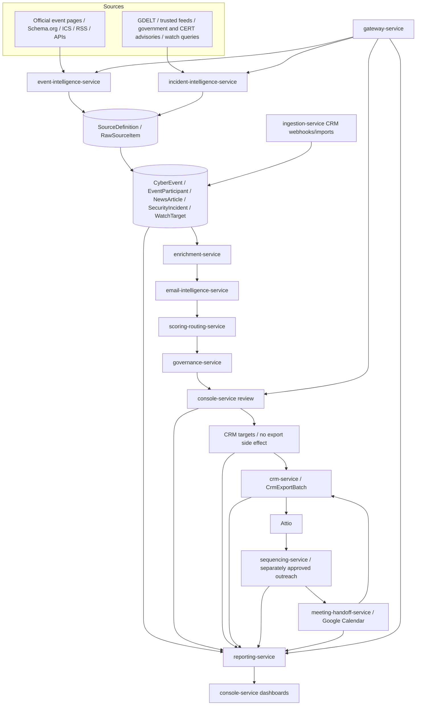

# Architecture

GhostRecon uses explicit Python microservices for intelligence acquisition and review-gated sales activation. GhostRecon owns source intake, normalization, lineage, entity resolution, confidence, governance, review state, and operational telemetry. Attio remains authoritative only for approved sales records exported through `CrmClient`.

`deep-research-report.md` describes the historical CRM-first research direction. [ADR 0004](adr/0004-intelligence-first-acquisition.md) supersedes that acquisition flow without changing the Python-microservice or provider-neutral CRM decisions.

## System Flow

## Service Ownership

| Boundary | Owns | Does not own |
| --- | --- | --- |
| Event intelligence | Event-source adapters, event/series normalization, participant-source permissions | Contact generation, CRM writes |
| Incident intelligence | Article discovery, incident candidates, corroboration evidence, watchlists | Full-article archives, breached data, CRM writes |
| Enrichment and email intelligence | Entity resolution and permitted public-business-contact enrichment | Source-reuse decisions, final approval |
| Scoring and governance | Explainable scores, corroboration policy, suppression, retention, approvals, inert CRM targets, audits | Dashboard read models, vendor-specific CRM mapping |
| Console and reporting | Python Dash console UI boundary, review actions, reporting read models, freshness indicators | Intelligence ingestion, independent dashboard service |
| CRM | Export batches, provider mapping, retry/reconciliation state | Acquisition, candidate approval, outreach enrollment |
| Sequencing | Separate outreach approval, sequence templates/enrollments, SMTP/IMAP execution, reply/bounce/unsubscribe handling, send rate limits | CRM export, meeting handoff, source acquisition |
| Meeting handoff | Google Calendar booking, AE/SE prep packets, meeting outcomes, follow-up tasks, CRM sync state | Source acquisition, CRM export approval, outreach execution |

The existing `ingestion-service` remains for Attio webhooks, imports, and other compatibility intake. It is not the primary acquisition path. Sprint 3 implements the shared `SourceDefinition` / `RawSourceItem` foundation, adapter helpers, source-health API, source-ingestion events, and source-fetch Celery task. Sprint 4 implements event intelligence; Sprint 5 implements incident article discovery, candidate incident detection, corroboration inputs, and watchlists; Sprint 6 implements entity resolution, permitted contact enrichment, persisted email candidates, verification payloads, and minimal review routing; Sprint 7 implements versioned scoring, governance review decisions, incident analyst decisions, suppression persistence, and non-exported CRM targets; Sprint 8 implements query-backed reporting read APIs and dashboard freshness/degraded metadata; Sprint 9 implements CRM export batches/items; Sprint 10 implements sequencing and outbound state; Sprint 11 implements Google Calendar meeting handoff, prep packets, outcomes, follow-up tasks, and meeting reporting read APIs; Sprint 12 implements the Python Dash operator dashboard in `console-service`.

## Runtime Pattern

- FastAPI services receive HTTP traffic and expose OpenAPI contracts.
- Celery workers process source fetches, parsing, enrichment, verification, projection, export, sequence sends, inbound email polling, and replay.
- Celery workers also expose meeting CRM-sync retry tasks for failed outcome/follow-up handoff syncs.
- PostgreSQL stores canonical entities, source/evidence lineage, audit history, suppression state, export state, and transactional outbox rows.
- Redis provides queues, locks, rate-limit buckets, and short-lived task state.
- `console-service` remains the only dashboard UI, mounts the Python Dash app at `/`, consumes reporting/gateway reads, and sends writes only through owning gateway APIs.
- Helm deploys implemented microservices independently. Event, incident, enrichment, email-intelligence, CRM, sequencing, meeting-handoff, governance, console, reporting, gateway, and ingestion services are registered in the chart; the shared source registry foundation remains in the common package.

## Canonical and Contract Pattern

- `SourceDefinition` and `RawSourceItem` are implemented as the shared ingestion foundation. Canonical intelligence and workflow entities now include `CyberEvent`, `EventParticipant`, `NewsArticle`, `SecurityIncident`, `WatchTarget`, `EntityResolutionCase`, `ContactEnrichmentCandidate`, `OrganizationEmailPattern`, `ReviewCandidate`, `CandidateScore`, `ReviewDecision`, `CrmTarget`, `CrmExportBatch`, `CrmExportItem`, `Sequence`, `SequenceStep`, `SequenceEnrollment`, `OutboundEmail`, `InboundEmailEvent`, `SequenceSuppressionEvent`, `MeetingHandoff`, `MeetingPrepPacket`, and `MeetingFollowUpTask`.
- All canonical entities retain GhostRecon IDs, source URLs, fetch timestamps, hashes, permission/licensing state, and evidence references.
- Lead sources include `cyber_event` and `security_incident` in addition to existing sources.
- Mutating APIs require an idempotency key; events use deterministic aggregate and source keys.
- Contracts and lifecycle rules are defined in [the intelligence pipeline specification](specifications/intelligence-pipeline.md).

## Reliability Pattern

- Source fetches use conditional requests, checkpoints, bounded retries, and per-source rate limits.
- Normalization is repeatable; deduplication occurs before downstream enrichment.
- Outbound side effects use transactional outbox rows.
- Failed side effects move to dead-letter state with source and audit context retained.
- Replays, CRM export retries, and sequence sends are explicit, idempotent, audited, and guarded by current policy.
- Meeting booking, prep-packet generation, outcome recording, cancellation, and CRM-sync retry are explicit, idempotent where mutating, and retain provider state for Google Calendar and Attio sync.
- Source freshness and materialized-view freshness are first-class health signals.

## Corroboration and Governance Pattern

- Every incident begins as `candidate`.
- `corroborated` requires an authoritative disclosure, multiple independent sources, or an audited analyst decision.
- Published participant reuse must be explicitly permitted; `unknown` and `prohibited` disable contact extraction and CRM export.
- Store permitted excerpts and metadata, not unlicensed full articles.
- Incident contact discovery is limited to public business roles in security, IT, risk, and communications; breached personal data is prohibited.
- Review approval requires current source lineage, corroboration, suppression, retention, lawful-basis, evidence-freshness, policy-hash, and optimistic-version checks.
- Review approval creates an inert CRM target only. CRM export and sequencing approval are separate decisions.
- Sequence enrollment requires an exported/current CRM target plus separate outreach approval; export success alone cannot start outreach.
- Meeting handoff requires an exported/current CRM target; booking a meeting can complete a linked active sequence enrollment but does not bypass CRM export or outreach approval.
- Suppression, retention, lawful basis, verified email, do-not-contact state, and approval state are re-evaluated before any outbound action.
- Email suppression state is checked before Google Calendar invites are created.
