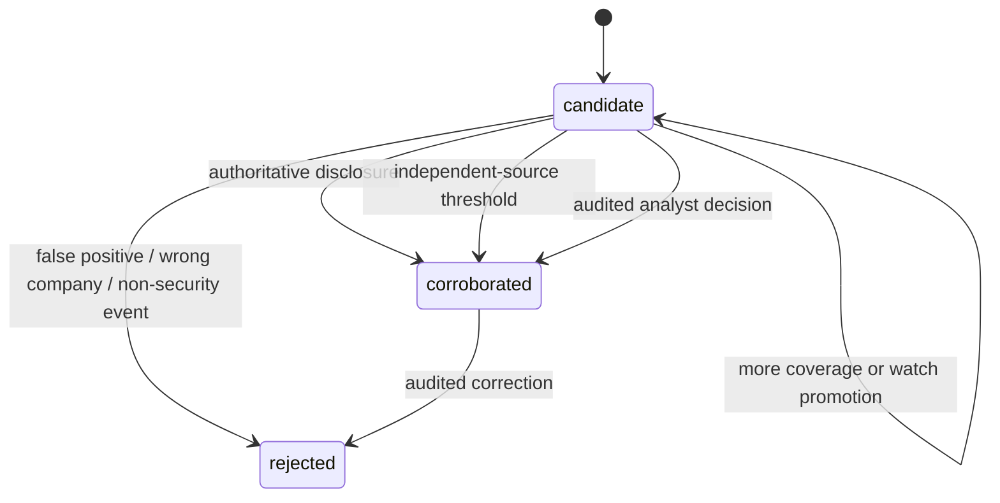

# Intelligence Pipeline and Data Model Specification

## Status and Scope

This specification defines the target contracts for Sprints 3–9. It is normative for intelligence source adapters, canonical records, review eligibility, and CRM export. Runtime implementation follows the sprint tracker. As of Sprint 6, the source registry, event intelligence runtime, incident intelligence/watchlist runtime, entity-resolution workflow, contact-enrichment workflow, persisted email candidates, verification payloads, and minimal read-only review queue are implemented.

The v1 scope is:

- global cybersecurity events and explicitly reusable published participants;
- global cyber-incident news, affected-company identification, and operator watchlists;
- entity and public-business-contact enrichment;
- explainable scoring, corroboration, governance, and analyst review;
- idempotent, provider-neutral CRM export; and
- reporting projections for the existing console.

The v1 scope excludes unlicensed article archives, access-control bypass, breached personal data, automated incident attribution, and automatic outreach enrollment.

## End-to-End Flow

Every transition retains the originating `SourceDefinition` and `RawSourceItem` IDs. Derived records never replace source evidence.

## Source Registry and Adapters

### Event Sources

Supported adapter classes:

- official conference and organizer pages;
- Schema.org `Event` JSON-LD or microdata;
- ICS calendars;
- RSS/Atom feeds; and
- approved provider APIs with documented terms and rate limits.

Initial event-series coverage should include DEF CON, Black Hat, BSides, OWASP, and FIRST. Seed names are discovery configuration, not permission to scrape or reuse participant data. Each concrete source must have its own policy record.

### News and Advisory Sources

Supported adapter classes:

- [GDELT DOC 2.0](https://blog.gdeltproject.org/gdelt-doc-2-0-api-debuts/) for JSON-accessible discovery across translated global coverage;
- trusted publisher RSS/Atom feeds;
- government, regulator, and CERT advisories; and
- configurable company, domain, incident, event-series, and topic queries.

GDELT is a discovery source, not an authoritative incident verdict. Corroboration depends on the underlying evidence and source independence.

### Source Policy

Every source declares:

- owner, adapter class, base URL, query scope, credentials reference, and rate-limit policy;
- polling interval, freshness objective, checkpoint strategy, and retry budget;
- robots/terms review state and date;
- permitted content storage: metadata only, metadata plus bounded excerpt, or licensed body;
- participant reuse state: `allowed`, `unknown`, or `prohibited`, with evidence and scope;
- default language and expected timezone behavior; and
- enabled, paused, or degraded operating state.

`allowed` requires evidence that the intended reuse is explicitly permitted. `unknown` is not treated as consent. For published participants, both `unknown` and `prohibited` set `contact_extraction_allowed=false` and `crm_export_allowed=false`.

Article storage defaults to metadata, canonical URL, hashes, normalized fields, and a bounded permitted excerpt. Full article bodies require an explicit license recorded on the source.

## Canonical Entities

All IDs are GhostRecon-generated UUIDs unless an external identifier is explicitly named. Timestamps are UTC ISO 8601 values; original source values are retained alongside normalized values.

| Entity | Required fields and invariants |
| --- | --- |
| `SourceDefinition` | `id`, `name`, `source_kind`, `adapter_type`, `base_url`, `policy_state`, `participant_reuse_state`, `content_storage_policy`, `freshness_slo_seconds`, `enabled`, `created_at`, `updated_at`. Policy evidence and review timestamps are required for `allowed`. |
| `RawSourceItem` | `id`, `source_definition_id`, `external_id` when present, `canonical_url`, `content_hash`, `retrieved_at`, `published_at`, `original_language`, `raw_metadata`, `permitted_excerpt`, `parse_status`, `idempotency_key`. It is immutable except for parse/replay status. |
| `CyberEvent` | `id`, `name`, `event_series_key`, original and normalized start/end, `source_timezone`, IANA timezone, format, venue/geography, topics, organizer identities, confidence, canonical state, and source-item lineage. |
| `EventParticipant` | `id`, `cyber_event_id`, published name, organization, published role/type, profile URL, `source_item_id`, reuse state/evidence, extraction eligibility, export eligibility, and resolution confidence. Do not add private or inferred personal fields. |
| `NewsArticle` | `id`, canonical URL, publisher, title, permitted excerpt, published/retrieved timestamps, original language, translated-title metadata and provenance, content hash, syndication cluster, and source-item lineage. Unlicensed full text is forbidden. |
| `SecurityIncident` | `id`, status, affected-company references/candidates, incident type/attack vector, first/last observed windows, geography, confidence, evidence links, corroboration method, analyst decision reference, and canonical/merge state. Status begins as `candidate`. |
| `WatchTarget` | `id`, `target_type`, canonical target key, display name, query configuration, enabled state, owner, origin incident when promoted, created-by actor, and timestamps. `target_type` is `company`, `domain`, `incident`, `event_series`, or `topic`. |
| `CrmExportBatch` | `id`, provider/workspace, requested-by actor, review-selection snapshot, idempotency key, status, item counts, started/completed timestamps, and reconciliation summary. A batch contains only approved targets. |
| `CrmExportItem` | `id`, batch ID, target type/ID, operation, dependency IDs, stable provider-match key, status, attempt count, provider record/list-entry IDs, last error, and reconciliation state. |

Existing `Account`, `Contact`, `Lead`, `Signal`, `Suppression`, and `AuditEvent` records remain canonical workflow entities. Lead-source taxonomy adds `cyber_event` and `security_incident`.

## Normalization and Deduplication

### Shared Rules

- Normalize URLs by removing known tracking parameters, preserving semantically relevant query values, resolving redirects within a bounded fetch policy, and storing the original URL.
- Store original text and language metadata only within source policy. Any translated title/excerpt records translation provider/version and keeps the original.
- Normalize timestamps to UTC while retaining the original value and IANA timezone. Ambiguous local time routes to review rather than guessing.
- Normalize company names, domains, countries, and topic identifiers without overwriting the source representation.
- A duplicate merge retains every source-item/evidence edge and records the merge actor or deterministic rule version.

### Match Keys

| Record | Exact candidates | Probabilistic candidates requiring confidence/review |
| --- | --- | --- |
| Raw item | source + external ID; canonical URL + content hash | canonical URL with materially changed content |
| Event | official external ID; series + start + organizer | normalized name + date window + geography/format |
| Article | canonical URL; publisher external ID; content hash | syndicated title/publish-window similarity |
| Incident | explicit authoritative case ID | resolved company + incident window + attack vector + overlapping evidence cluster |
| Participant | event + source participant ID/profile URL | event + normalized name + organization + published role |

Probabilistic merges must not discard either record before audit. Company resolution must distinguish similarly named organizations and subsidiaries.

## Incident Lifecycle and Watchlists

Corroboration rules:

1. An authoritative disclosure is an explicit statement by the affected organization or a competent authority tied to the case.
2. Multiple-source corroboration requires at least two independently produced sources. Syndicated copies, copied press releases, and common upstream reporting count as one evidence family.
3. Analyst corroboration requires an actor, timestamp, reason, evidence snapshot, and policy version.

Promoting a global incident creates an incident `WatchTarget` whose `origin_incident_id` points to the existing incident. It does not create a second incident or automatically change corroboration. Subsequent articles attach to the same canonical incident/evidence case when resolution rules match.

## Event Contracts

All events use the common envelope:

- `event_id`, `event_name`, `occurred_at`, `producer`, `schema_version`;
- `aggregate_type`, `aggregate_id`, `idempotency_key`, `correlation_id`;
- `source_definition_id` and `source_item_ids` when applicable; and
- `payload` containing canonical IDs and changed fields, not unlicensed source bodies.

| Event | Producer | Minimum semantic payload |
| --- | --- | --- |
| `cyber_event.discovered` | event intelligence | event ID, series, time/zone, geography, source IDs, dedupe outcome |
| `event_participant.discovered` | event intelligence | participant/event IDs, published role, reuse state, extraction/export eligibility |
| `news_article.ingested` | incident intelligence | article ID, canonical URL/hash, language, publish time, source ID |
| `security_incident.detected` | incident intelligence | incident ID, candidate companies, confidence, evidence IDs, status=`candidate` |
| `security_incident.corroborated` | incident intelligence/governance | incident ID, method, evidence snapshot or analyst audit ID |
| `watch_target.created` | incident intelligence | watch-target ID/type/key, owner, origin incident if present |
| `crm_export.batch_started` | CRM | batch ID, provider, approved selection hash, item count |
| `crm_export.item_succeeded` | CRM | batch/item/target IDs, provider record IDs, reconciliation state |
| `crm_export.item_failed` | CRM | batch/item/target IDs, retryability, typed error, attempt count |
| `crm_export.batch_completed` | CRM | batch ID, succeeded/failed/skipped counts, reconciliation summary |

Event payload changes require a new `schema_version`. Consumers must ignore unknown additive fields and reject incompatible major versions.

## HTTP APIs

The gateway exposes these target routes; feature services own the behavior.

### Search and Detail

- `GET /v1/intelligence/events`
- `GET /v1/intelligence/events/{event_id}`
- `GET /v1/intelligence/events/{event_id}/participants`
- `GET /v1/intelligence/participants`
- `GET /v1/intelligence/incidents`
- `GET /v1/intelligence/incidents/{incident_id}`
- `GET /v1/intelligence/sources/health`

Search APIs support cursor pagination, explicit sort, UTC date ranges, geography, language, confidence/status, source, and domain-specific filters. Responses include lineage summaries and projection freshness.

### Watchlists

- `POST /v1/intelligence/watch-targets`
- `GET /v1/intelligence/watch-targets`
- `PATCH /v1/intelligence/watch-targets/{watch_target_id}`
- `POST /v1/intelligence/incidents/{incident_id}/promote-to-watchlist`

Promotion returns the existing watch target on an idempotent retry and always returns `origin_incident_id`.

### Review and CRM Targets

- `GET /v1/review/candidates`
- `GET /v1/review/crm-targets`
- `POST /v1/review/candidates/{candidate_id}/approve`
- `POST /v1/review/candidates/{candidate_id}/reject`
- `POST /v1/review/candidates/bulk-decision`
- `POST /v1/crm/exports`
- `GET /v1/crm/exports/{batch_id}`
- `POST /v1/crm/exports/{batch_id}/retry-failed`

Every mutation requires an `Idempotency-Key`, authenticated actor, reason where required, optimistic version, and audit record. Bulk decisions reject mixed candidate types or policy states that cannot be evaluated under one displayed evidence snapshot.

## Review Eligibility

A review candidate contains:

- canonical target and candidate type;
- source and evidence summaries with freshness;
- reuse/content policy state;
- entity-resolution confidence and alternatives;
- incident corroboration state when applicable;
- contact/email verification, suppression, and retention state;
- score reasons and policy version; and
- proposed decision and downstream effect.

An approved candidate becomes a CRM target only when current policy permits export. Approval is invalidated by a material source-policy change, canonical merge, suppression change, stale evidence beyond policy, or target-data change covered by optimistic locking.

## CRM Export Contract

`CrmClient` provides provider-neutral operations for object/schema validation, stable-identifier upsert, relationship/list insertion, batch status, and reconciliation. Provider-specific names never appear in upstream review contracts.

### Attio Mapping

| GhostRecon target | Attio mapping | Stable match and lineage |
| --- | --- | --- |
| Event | custom `cyber_events` object | GhostRecon event ID; source URLs and lineage summary |
| Incident | custom `security_incidents` object | GhostRecon incident ID; status, evidence URLs, affected companies |
| Organization | standard Companies object | normalized primary domain plus GhostRecon account ID |
| Eligible business contact | standard People object | verified business email plus GhostRecon contact ID; never name-only |

Create separate typed lists because an [Attio list declares a `parent_object`](https://docs.attio.com/rest-api/endpoint-reference/lists/create-a-list):

- events → `cyber_events`;
- event participants → People;
- incidents → `security_incidents`;
- affected companies → Companies; and
- incident contacts → People.

Before adding list entries, [upsert records using a matching attribute](https://docs.attio.com/rest-api/endpoint-reference/records/upsert-a-record). Companies use a stable normalized domain; People require an eligible verified business email. Custom objects use GhostRecon IDs. Preserve GhostRecon IDs, source-lineage summaries, and provider IDs for reconciliation.

An item may be `pending`, `running`, `succeeded`, `failed_retryable`, `failed_terminal`, `skipped_policy`, or `reconciled`. A batch may be `pending`, `running`, `partial`, `succeeded`, `failed`, or `reconciling`. Retries operate on failed items and never duplicate successful object or list-entry writes.

CRM export requires analyst approval and never calls `sequencing-service`. Outreach requires a later, independent governance and sequence-eligibility decision.

## Security, Privacy, and Retention

- Apply least privilege to source credentials, watch queries, review decisions, and CRM exports.
- Encrypt provider tokens and sensitive configuration outside source control.
- Treat source content and translated text as untrusted input; sanitize rendered excerpts and never execute embedded instructions.
- Store no breached personal data and no personal contact data beyond approved public-business-contact scope.
- Record lawful basis and retention class before CRM eligibility.
- Enforce deletion/retention across canonical records, projections, export metadata, and provider reconciliation where legally required, while retaining the minimum immutable audit evidence permitted by policy.

## Acceptance Tests

- Event and article replays deduplicate while retaining all source lineage.
- Timezone normalization preserves original values and handles DST/ambiguous time.
- Original-language and translation-provenance metadata survive ingestion and display.
- Unknown/prohibited participant sources cannot create contact, review-export, or CRM-export candidates.
- Global incidents can be promoted to watchlists without changing origin IDs; later coverage joins the same canonical case.
- False-positive rejection and each corroboration method produce complete audit evidence.
- Entity resolution distinguishes same-name companies and records analyst merges.
- Suppression, retention, and approval changes invalidate stale CRM eligibility.
- Bulk review rejects incompatible selections and audits every candidate result.
- CRM retries respect rate limits, isolate partial failures, avoid duplicates, and reconcile provider IDs.
- Source and dashboard freshness states are testable under outage and recovery.
